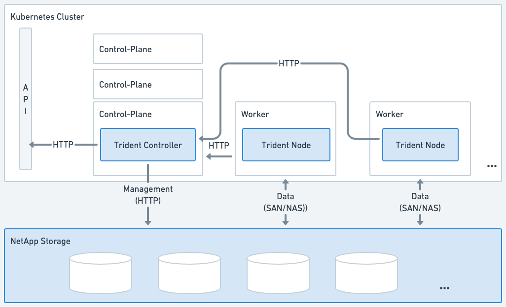
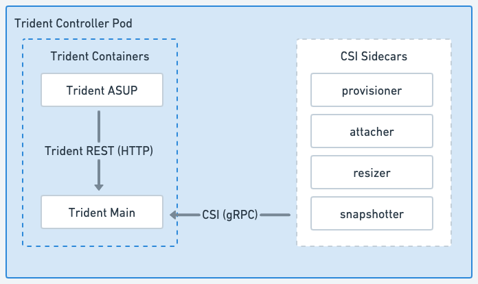
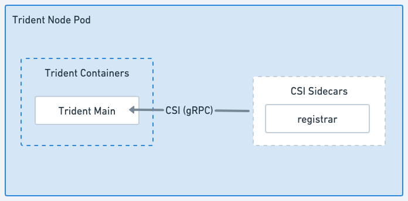

= Learn about Astra Trident
:hardbreaks:
:icons: font
:imagesdir: ../media/

[.lead]
Astra Trident is a fully-supported open source project maintained by NetApp as part of the link:https://docs.netapp.com/us-en/astra-family/intro-family.html[Astra product family^]. It has been designed to help you meet your containerized applications' persistence demands using industry-standard interfaces, such as the Container Storage Interface (CSI).

== What is Astra?

Astra makes it easier for enterprises to manage, protect, and move their data-rich containerized workloads running on Kubernetes within and across public clouds and on-premises. 

Astra provisions and provides persistent container storage built on Astra Trident. It also offers advanced application-aware data management functionality, such as snapshot, backup and restore, activity logs, and active cloning for data protection, disaster/data recovery, data audit, and migration use-cases for Kubernetes workloads.

Learn more about link:https://bluexp.netapp.com/astra[Astra or sign up for a free trial^]. 

== What is Astra Trident?
Astra Trident is a Container Storage Interface (CSI) compliant dynamic storage orchestrator that natively integrates with link:https://kubernetes.io/[Kubernetes^]. Astra Trident enables consumption and management of storage resources across all popular NetApp storage platforms, in the public cloud or on premises, including ONTAP (AFF, FAS, Select, Cloud, Amazon FSx for NetApp ONTAP), Element software (NetApp HCI, SolidFire), Azure NetApp Files service, and Cloud Volumes Service on Google Cloud. 

NOTE: If this is your first time using Kubernetes, you should familiarize yourself with the link:https://kubernetes.io/docs/home/[Kubernetes concepts and tools^].

== Astra Trident architecture
Astra Trident deploys as a single <<Trident Controller Pod>> and one or more <<Trident Node Pods>> on the Kubernetes cluster and uses standard Kubernetes _CSI Sidecar Containers_ to simplify the deployment of CSI plugins. link:https://kubernetes-csi.github.io/docs/sidecar-containers.html[Kubernetes CSI Sidecar Containers^] are maintained by the Kubernetes Storage community. 

.Astra Trident deployed on the Kubernetes cluster

=== Trident Controller Pod
The Trident Controller Pod is a single Pod running the CSI Controller plugin. 

* Responsible for provisioning and managing volumes in NetApp storage
* Managed by a Kubernetes DaemonSet 
* Can run on the control-plane or worker nodes, depending on installation parameters.

.Trident Controller Pod diagram

=== Trident Node Pods
Trident Node Pods are privileged Pods running the CSI Node plugin. 

* Responsible for mounting and unmounting storage for Pods running on the host
* Managed by a Kubernetes DaemonSet
* Must run on any node that will mount NetApp storage

.Trident Node Pod diagram

== Supported Kubernetes cluster architectures

Astra Trident is supported with the following Kubernetes architectures:

[cols=3*,options="header"]
|===
|Kubernetes cluster architectures
|Supported
|Default install
|Single master, compute |Yes a| Yes
|Multiple master, compute |Yes a|
Yes
|Master, `etcd`, compute |Yes a|
Yes
|Master, infrastructure, compute |Yes a|
Yes
|===

== Take the Astra Trident test drive
You can request to take the "Easily Deploy and Clone Persistent Storage for Containerized Workloads" link:https://www.netapp.com/us/try-and-buy/test-drive/index.aspx[NetApp Test Drive^] using a ready-to-use lab image. The test drive provides a sandbox environment with a three-node Kubernetes cluster and Astra Trident installed and configured. This is a great way to familiarize yourself with Astra Trident and explore its features.

Another option is to see the link:https://kubernetes.io/docs/setup/independent/install-kubeadm/[kubeadm Install Guide] provided by Kubernetes.

NOTE: Don't use a Kubernetes cluster that you build using these instructions in a production environment. Use the production deployment guides provided by your distribution for production-ready clusters.

== For more information

* https://docs.netapp.com/us-en/astra-family/intro-family.html[NetApp Astra product family]
* https://docs.netapp.com/us-en/astra/get-started/intro.html[Astra Control Service documentation^]
* https://docs.netapp.com/us-en/astra-control-center/index.html[Astra Control Center documentation^]
* https://docs.netapp.com/us-en/astra-automation/get-started/before_get_started.html[Astra API documentation^]
