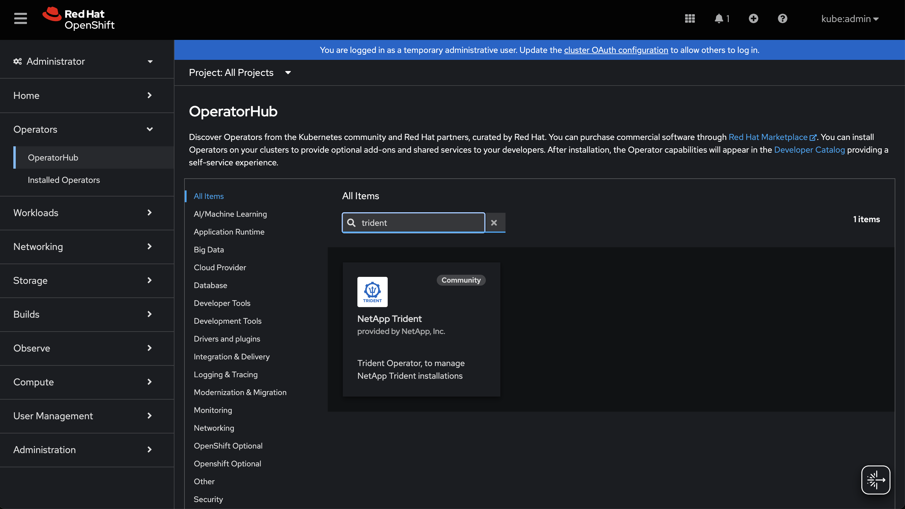
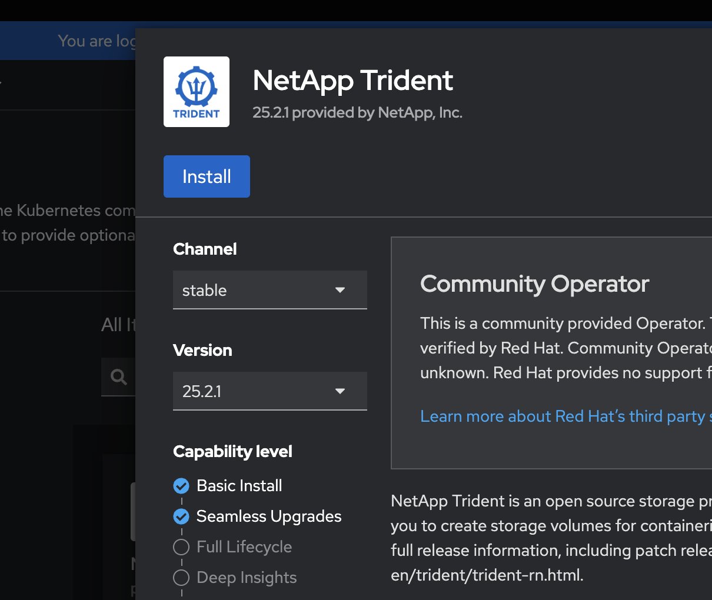
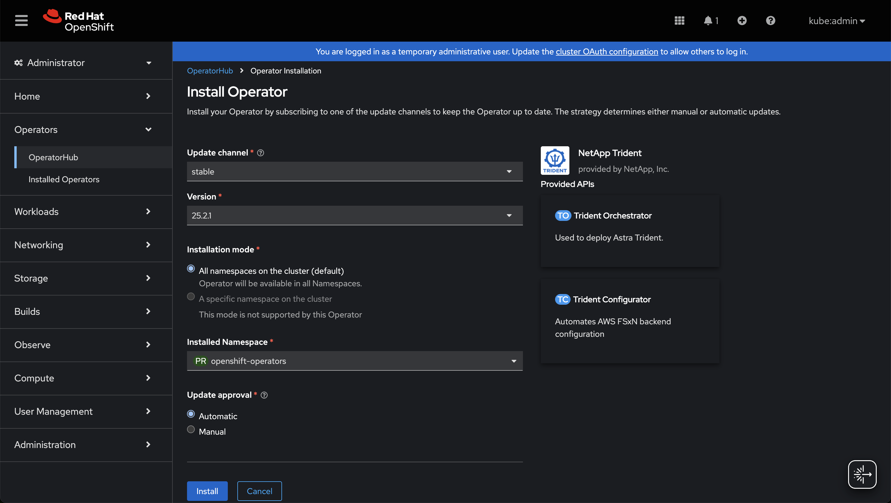
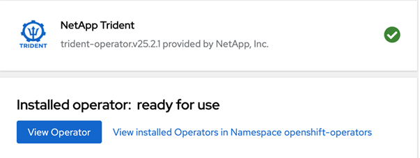
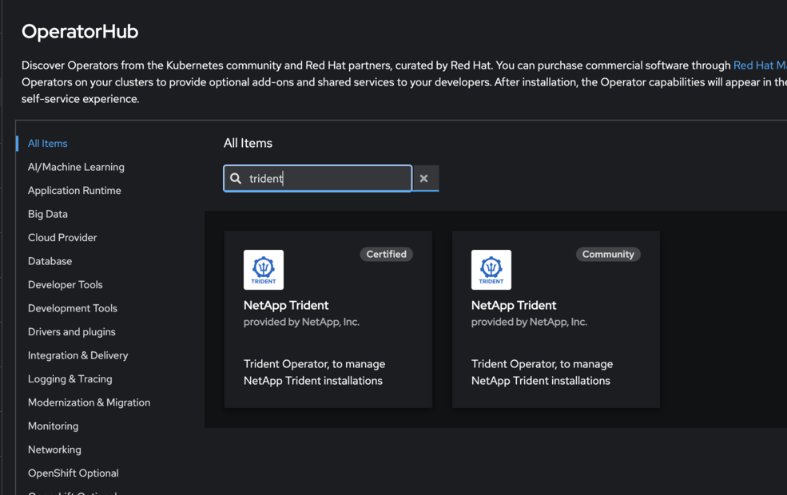
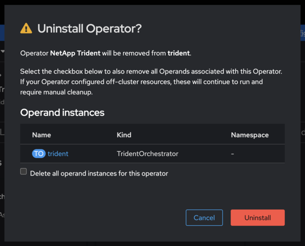

= Install Trident using OpenShift OperatorHub
:hardbreaks:
:icons: font
:imagesdir: ../media/

[.lead]
If you use Red Hat OpenShift, you can install NetApp Trident using the Red Hat certified operator. Use this procedure to install Trident from the Red Hat OpenShift Container Platform.

.Before you begin
Before you begin the installation, link:../trident-get-started/requirements.html/[prepare your environment for Trident installation].

== Find and install the Trident operator

.Steps

. Navigate to OpenShift OperatorHub and search for NetApp Trident.
+ 

+
. Click *Install*.
+ 

+
. Select the required options and click *Install*.
+ 

+
. Once the installation is complete, the operator is visible in the list of installed operators.
+ 

+
. Create a TORC like the operator bundle install.

== Uninstall Trident operator

.Steps

. Select the Trident operator from the list of installed operator.
+ 

+
. Select if you want to delete all the operand instance from the operator.
+ 

WARNING: If you do not select the *Delete all operand instances from this operator* checkbox, Trident will not be uninstalled.
+
. Click *Uninstall*.