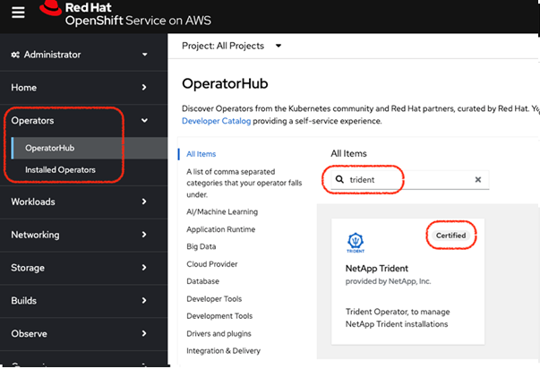

= Install Trident using OpenShift OperatorHub
:hardbreaks:
:icons: font
:imagesdir: ../media/

[.lead]
If you use Red Hat OpenShift, you can install NetApp Trident using the Red Hat certified operator. Use this procedure to install Trident from the Red Hat OpenShift Container Platform.

.Before you begin
Before you begin the installation, link:../trident-get-started/requirements.html[prepare your environment for Trident installation].

== Find and install the Trident operator

.Steps

. Navigate to OpenShift OperatorHub and search for NetApp Trident.
+ 

+
. Click *NetApp Trident* to open the installation settings.
. Select the required options and click *Install* to open the Operator configuration.
+
image::../media/openshift-operator-02.png[Install]
+ 
NOTE: Make sure that you select the most recent Operator version.
. Retain all the parameters as they are and click *Install*. 
+ 
image::../media/openshift-operator-03.png[Install]
+
Once the installation is complete, the Operator is visible in the list of installed operators and it is ready to use.
. Click *View Operator* to view the details of the Operator.
+ 
image::../media/openshift-operator-04.png[Installed]
. Under *Trident Orchestrator*, click *Create instance*.
+ 
image::../media/openshift-operator-07.png[Installed]
. Click *YAML view* and paste the following in the form:
+
[source,yaml]
-------
apiVersion: trident.netapp.io/v1 
kind: TridentOrchestrator 
metadata: 
  name: trident 
  namespace: openshift-operators 
spec: 
  IPv6: false 
  debug: false 
  nodePrep: 
  - iscsi 
  imageRegistry: '' 
  k8sTimeout: 30 
  namespace: trident 
  silenceAutosupport: false 
-------
+
====
* Red Hat Enterprise Linux CoreOS (RHCOS)  does not have iSCSI enabled and configured.  
* You can add the `nodePrep` parameter to configure and enable both iSCSI and Multipath services on all OpenShift worker nodes.
* Beginning with OpenShift 4.19, the minimum Trident version supported for this feature is 25.06.1.
====
. Click *Create*; the Trident Orchestrator will be fully installed.
+ 
image::../media/openshift-operator-08.png[Installed]

== Uninstall Trident operator

.Steps

. Select the Trident operator from the list of installed operator.
. Select if you want to delete all the operand instance from the operator.
+
WARNING: If you do not select the *Delete all operand instances from this operator* checkbox, Trident will not be uninstalled.
+
. Click *Uninstall*.