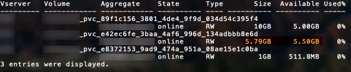

= ONTAP SAN configuration options and examples
:hardbreaks:
:icons: font
:imagesdir: ../media/

Learn about how to create and use ONTAP SAN drivers with your Astra Trident installation. This section provides backend configuration examples and details about how to map backends to StorageClasses.

== Backend configuration options

See the following table for the backend configuration options:

[cols=3,options="header"]
|===
|Parameter |Description |Default
|`version` | |Always 1

|`storageDriverName` | Name of the storage driver |“ontap-nas”, “ontap-nas-economy”, “ontap-nas-flexgroup”, “ontap-san”, “ontap-san-economy”

|`backendName`  |Custom name or the storage backend |Driver name + “_” + dataLIF

|`managementLIF` |IP address of a cluster or SVM management LIF 

For seamless MetroCluster switchover, you must specify an SVM management LIF.

A fully-qualified domain name (FQDN) can be specified.

Can be set to use IPv6 addresses if Astra Trident was installed using the `--use-ipv6` flag. IPv6 addresses must be defined in square brackets, such as [28e8:d9fb:a825:b7bf:69a8:d02f:9e7b:3555].  |“10.0.0.1”, “[2001:1234:abcd::fefe]”

|`dataLIF` |IP address of protocol LIF. 

*Do not specify for iSCSI.* Astra Trident uses link:https://docs.netapp.com/us-en/ontap/san-admin/selective-lun-map-concept.html[ONTAP Selective LUN Map^] to discover the iSCI LIFs needed to establish a multi path session. A warning is generated if `dataLIF` is explicitly defined. 

|Derived by the SVM

|`useCHAP` |Use CHAP to authenticate iSCSI for ONTAP SAN drivers [Boolean]. 

Set to `true` for Astra Trident to configure and use bidirectional CHAP as the default authentication for the SVM given in the backend. Refer to link:ontap-san-prep.html[Prepare to configure backend with ONTAP SAN drivers] for details.

|false

|`chapInitiatorSecret` |CHAP initiator secret. Required if `useCHAP=true` |“”

|`labels` |Set of arbitrary JSON-formatted labels to apply on volumes |“”

|`chapTargetInitiatorSecret` |CHAP target initiator secret. Required if `useCHAP=true` |“”

|`chapUsername` |Inbound username. Required if `useCHAP=true` |“”

|`chapTargetUsername` |Target username. Required if `useCHAP=true` |“”

|`clientCertificate` |Base64-encoded value of client certificate. Used for certificate-based auth |“”

|`clientPrivateKey` |Base64-encoded value of client private key. Used for certificate-based auth |“”

|`trustedCACertificate` |Base64-encoded value of trusted CA certificate. Optional. Used for certificate-based authentication. |“”

|`username` |Username needed to communicate with the ONTAP cluster. Used for credential-based authentication. |“”

|`password` |Password needed to communicate with the ONTAP cluster. Used for credential-based authentication. |“”

|`svm` |Storage virtual machine to use |Derived if an SVM `managementLIF` is specified

|`igroupName` |Name of the igroup for SAN volumes to use. Refer to <
> for more information. |“trident-<backend-UUID>”

|`storagePrefix` |Prefix used when provisioning new volumes in the SVM. 

Cannot be modified later. To update this parameter, you will need to create a new backend.|“trident”

|`limitAggregateUsage` |Fail provisioning if usage is above this percentage. 

If you are using an Amazon FSx for NetApp ONTAP backend, do not specify  `limitAggregateUsage`. The provided `fsxadmin` and `vsadmin` do not contain the permissions required to retrieve aggregate usage and limit it using Astra Trident.|“” (not enforced by default)

|`limitVolumeSize` |Fail provisioning if requested volume size is above this value. 

Also restricts the maximum size of the volumes it manages for qtrees and LUNs.
|“”  (not enforced by default)

|`lunsPerFlexvol` |Maximum LUNs per Flexvol, must be in range [50, 200] |“100”

|`debugTraceFlags` |Debug flags to use when troubleshooting. Example, {“api”:false, “method”:true} 

Do not use unless you are troubleshooting and require a detailed log dump.|null

|`useREST` |Boolean parameter to use ONTAP REST APIs. *Tech preview* 

`useREST` is provided as a **tech preview** that is recommended for test environments and not for production workloads. When set to `true`, Astra Trident will use ONTAP REST APIs to communicate with the backend. This feature requires ONTAP 9.11.1 and later. In addition, the ONTAP login role used must have access to the `ontap` application. This is satisfied by the pre-defined `vsadmin` and `cluster-admin` roles.

`useREST` is not supported with MetroCluster.|false

|===

=== Details about `igroupName`
`igroupName` can be set to an igroup that is already created on the ONTAP cluster. If unspecified, Astra Trident automatically creates an igroup named `trident-<backend-UUID>`. 

If providing a pre-defined igroupName, we recommend using one igroup per Kubernetes cluster, if the SVM is to be shared between environments. This is necessary for Astra Trident to automatically maintain IQN additions and deletions.

* `igroupName` can be updated to point to a new igroup that is created and managed on the SVM outside of Astra Trident.
* `igroupName` can be omitted. In this case, Astra Trident will create and manage an igroup named `trident-<backend-UUID>`  automatically.

In both cases, volume attachments will continue to be accessible. Future volume attachments will use the updated igroup. This update does not disrupt access to volumes present on the backend.

== Backend configuration options for provisioning volumes

You can control default provisioning using these options in the `defaults` section of the configuration. For an example, see the configuration examples below.

[cols=3,options="header"]
|===
|Parameter |Description |Default
|`spaceAllocation` |Space-allocation for LUNs |“true”

|`spaceReserve` |Space reservation mode; “none” (thin) or “volume” (thick) |“none”

|`snapshotPolicy` |Snapshot policy to use |“none”

|`qosPolicy` |QoS policy group to assign for volumes created. Choose one of qosPolicy or adaptiveQosPolicy per storage pool/backend. 

Using QoS policy groups with Astra Trident requires ONTAP 9.8 or later. We recommend using a non-shared QoS policy group and ensuring the policy group is applied to each constituent individually. A shared QoS policy group will enforce the ceiling for the total throughput of all workloads. |“”

|`adaptiveQosPolicy` |Adaptive QoS policy group to assign for volumes created. Choose one of qosPolicy or adaptiveQosPolicy per storage pool/backend |“”

|`snapshotReserve` |Percentage of volume reserved for snapshots	“0” |If `snapshotPolicy` is “none”, else “”

|`splitOnClone` |Split a clone from its parent upon creation |“false”

|`splitOnClone` |Split a clone from its parent upon creation |“false”

|`encryption` |Enable NetApp Volume Encryption (NVE) on the new volume; defaults to `false`. NVE must be licensed and enabled on the cluster to use this option. 

If NAE is enabled on the backend, any volume provisioned in Astra Trident will be NAE enabled. 

For more information, refer to: link:../trident-reco/security-reco.html[How Astra Trident works with NVE and NAE]. |“false”

|`luksEncryption` | Enable LUKS encryption. Refer to link:../trident-reco/security-reco.html#Use-Linux-Unified-Key-Setup-(LUKS)[Use Linux Unified Key Setup (LUKS)]. | ""

|`securityStyle` |Security style for new volumes |“unix”

|`tieringPolicy` |Tiering policy to use	“none” |“snapshot-only” for pre-ONTAP 9.5 SVM-DR configuration

|===

=== Volume provisioning examples
Here’s an example with defaults defined:
----
{
 "version": 1,
 "storageDriverName": "ontap-san",
 "managementLIF": "10.0.0.1",
 "dataLIF": "10.0.0.2",
 "svm": "trident_svm",
 "username": "admin",
 "password": "password",
 "labels": {"k8scluster": "dev2", "backend": "dev2-sanbackend"},
 "storagePrefix": "alternate-trident",
 "igroupName": "custom",
 "debugTraceFlags": {"api":false, "method":true},
 "defaults": {
     "spaceReserve": "volume",
     "qosPolicy": "standard",
     "spaceAllocation": "false",
     "snapshotPolicy": "default",
     "snapshotReserve": "10"
 }
}
----

NOTE: For all volumes created using the `ontap-san` driver, Astra Trident adds an extra 10 percent capacity to the FlexVol to accommodate the LUN metadata. The LUN will be provisioned with the exact size that the user requests in the PVC. Astra Trident adds 10 percent to the FlexVol (shows as Available size in ONTAP). Users will now get the amount of usable capacity they requested. This change also prevents LUNs from becoming read-only unless the available space is fully utilized. This does not apply to ontap-san-economy.

For backends that define `snapshotReserve`, Astra Trident calculates the size of volumes as follows:
----
Total volume size = [(PVC requested size) / (1 - (snapshotReserve percentage) / 100)] * 1.1
----

The 1.1 is the extra 10 percent Astra Trident adds to the FlexVol to accommodate the LUN metadata. For `snapshotReserve` = 5%, and PVC request = 5GiB, the total volume size is 5.79GiB and the available size is 5.5GiB. The `volume show` command should show results similar to this example:

Currently, resizing is the only way to use the new calculation for an existing volume.

== Minimal configuration examples

The following examples show basic configurations that leave most parameters to default. This is the easiest way to define a backend.

NOTE: If you are using Amazon FSx on NetApp ONTAP with Astra Trident, the recommendation is to specify DNS names for LIFs instead of IP addresses.

=== `ontap-san` driver with certificate-based authentication

This is a minimal backend configuration example. `clientCertificate`, `clientPrivateKey`, and `trustedCACertificate` (optional, if using trusted CA) are populated in `backend.json` and take the base64-encoded values of the client certificate, private key, and trusted CA certificate, respectively.
----
{
    "version": 1,
    "storageDriverName": "ontap-san",
    "backendName": "DefaultSANBackend",
    "managementLIF": "10.0.0.1",
    "dataLIF": "10.0.0.3",
    "svm": "svm_iscsi",
    "useCHAP": true,
    "chapInitiatorSecret": "cl9qxIm36DKyawxy",
    "chapTargetInitiatorSecret": "rqxigXgkesIpwxyz",
    "chapTargetUsername": "iJF4heBRT0TCwxyz",
    "chapUsername": "uh2aNCLSd6cNwxyz",
    "igroupName": "trident",
    "clientCertificate": "ZXR0ZXJwYXB...ICMgJ3BhcGVyc2",
    "clientPrivateKey": "vciwKIyAgZG...0cnksIGRlc2NyaX",
    "trustedCACertificate": "zcyBbaG...b3Igb3duIGNsYXNz"
}
----

=== `ontap-san` driver with bidirectional CHAP

This is a minimal backend configuration example. This basic configuration creates an `ontap-san` backend with `useCHAP` set to `true`.
----
{
    "version": 1,
    "storageDriverName": "ontap-san",
    "managementLIF": "10.0.0.1",
    "dataLIF": "10.0.0.3",
    "svm": "svm_iscsi",
    "labels": {"k8scluster": "test-cluster-1", "backend": "testcluster1-sanbackend"},
    "useCHAP": true,
    "chapInitiatorSecret": "cl9qxIm36DKyawxy",
    "chapTargetInitiatorSecret": "rqxigXgkesIpwxyz",
    "chapTargetUsername": "iJF4heBRT0TCwxyz",
    "chapUsername": "uh2aNCLSd6cNwxyz",
    "igroupName": "trident",
    "username": "vsadmin",
    "password": "secret"
}
----

=== `ontap-san-economy` driver

----
{
    "version": 1,
    "storageDriverName": "ontap-san-economy",
    "managementLIF": "10.0.0.1",
    "svm": "svm_iscsi_eco",
    "useCHAP": true,
    "chapInitiatorSecret": "cl9qxIm36DKyawxy",
    "chapTargetInitiatorSecret": "rqxigXgkesIpwxyz",
    "chapTargetUsername": "iJF4heBRT0TCwxyz",
    "chapUsername": "uh2aNCLSd6cNwxyz",
    "igroupName": "trident",
    "username": "vsadmin",
    "password": "secret"
}
----

== Examples of backends with virtual pools

In the sample backend definition file shown below, specific defaults are set for all storage pools, such as `spaceReserve` at none, `spaceAllocation` at false, and `encryption` at false. The virtual pools are defined in the storage section.

Astra Trident sets provisioning labels in the “Comments” field. Comments are set on the FlexVol. Astra Trident copies all labels present on a virtual pool to the storage volume at provisioning. For convenience, storage administrators can define labels per virtual pool and group volumes by label. 

In this example, some of the storage pool sets their own `spaceReserve`, `spaceAllocation`, and `encryption` values, and some pools overwrite the default values set above.
----
{
    "version": 1,
    "storageDriverName": "ontap-san",
    "managementLIF": "10.0.0.1",
    "dataLIF": "10.0.0.3",
    "svm": "svm_iscsi",
    "useCHAP": true,
    "chapInitiatorSecret": "cl9qxIm36DKyawxy",
    "chapTargetInitiatorSecret": "rqxigXgkesIpwxyz",
    "chapTargetUsername": "iJF4heBRT0TCwxyz",
    "chapUsername": "uh2aNCLSd6cNwxyz",
    "igroupName": "trident",
    "username": "vsadmin",
    "password": "secret",

    "defaults": {
          "spaceAllocation": "false",
          "encryption": "false",
          "qosPolicy": "standard"
    },
    "labels":{"store": "san_store", "kubernetes-cluster": "prod-cluster-1"},
    "region": "us_east_1",
    "storage": [
        {
            "labels":{"protection":"gold", "creditpoints":"40000"},
            "zone":"us_east_1a",
            "defaults": {
                "spaceAllocation": "true",
                "encryption": "true",
                "adaptiveQosPolicy": "adaptive-extreme"
            }
        },
        {
            "labels":{"protection":"silver", "creditpoints":"20000"},
            "zone":"us_east_1b",
            "defaults": {
                "spaceAllocation": "false",
                "encryption": "true",
                "qosPolicy": "premium"
            }
        },
        {
            "labels":{"protection":"bronze", "creditpoints":"5000"},
            "zone":"us_east_1c",
            "defaults": {
                "spaceAllocation": "true",
                "encryption": "false"
            }
        }
    ]
}
----

Here is an iSCSI example for the `ontap-san-economy` driver:
----
{
    "version": 1,
    "storageDriverName": "ontap-san-economy",
    "managementLIF": "10.0.0.1",
    "svm": "svm_iscsi_eco",
    "useCHAP": true,
    "chapInitiatorSecret": "cl9qxIm36DKyawxy",
    "chapTargetInitiatorSecret": "rqxigXgkesIpwxyz",
    "chapTargetUsername": "iJF4heBRT0TCwxyz",
    "chapUsername": "uh2aNCLSd6cNwxyz",
    "igroupName": "trident",
    "username": "vsadmin",
    "password": "secret",

    "defaults": {
          "spaceAllocation": "false",
          "encryption": "false"
    },
    "labels":{"store":"san_economy_store"},
    "region": "us_east_1",
    "storage": [
        {
            "labels":{"app":"oracledb", "cost":"30"},
            "zone":"us_east_1a",
            "defaults": {
                "spaceAllocation": "true",
                "encryption": "true"
            }
        },
        {
            "labels":{"app":"postgresdb", "cost":"20"},
            "zone":"us_east_1b",
            "defaults": {
                "spaceAllocation": "false",
                "encryption": "true"
            }
        },
        {
            "labels":{"app":"mysqldb", "cost":"10"},
            "zone":"us_east_1c",
            "defaults": {
                "spaceAllocation": "true",
                "encryption": "false"
            }
        }
    ]
}
----

== Map backends to StorageClasses

The following StorageClass definitions refer to the above virtual pools. Using the `parameters.selector` field, each StorageClass calls out which virtual pool(s) can be used to host a volume. The volume will have the aspects defined in the chosen virtual pool.

* The first StorageClass (`protection-gold`) will map to the first, second virtual pool in the `ontap-nas-flexgroup` backend and the first virtual pool in the `ontap-san` backend. These are the only pool offering gold level protection.
* The second StorageClass (`protection-not-gold`) will map to the third, fourth virtual pool in `ontap-nas-flexgroup` backend and the second, third virtual pool in `ontap-san` backend. These are the only pools offering protection level other than gold.
* The third StorageClass (`app-mysqldb`) will map to the fourth virtual pool in `ontap-nas` backend and the third virtual pool in `ontap-san-economy` backend. These are the only pools offering storage pool configuration for mysqldb type app.
* The fourth StorageClass (`protection-silver-creditpoints-20k`) will map to the third virtual pool in `ontap-nas-flexgroup` backend and the second virtual pool in `ontap-san` backend. These are the only pools offering gold-level protection at 20000 creditpoints.
* The fifth StorageClass (`creditpoints-5k`) will map to the second virtual pool in `ontap-nas-economy` backend and the third virtual pool in `ontap-san` backend. These are the only pool offerings at 5000 creditpoints.

Astra Trident will decide which virtual pool is selected and will ensure the storage requirement is met.
----
apiVersion: storage.k8s.io/v1
kind: StorageClass
metadata:
  name: protection-gold
provisioner: netapp.io/trident
parameters:
  selector: "protection=gold"
  fsType: "ext4"
---
apiVersion: storage.k8s.io/v1
kind: StorageClass
metadata:
  name: protection-not-gold
provisioner: netapp.io/trident
parameters:
  selector: "protection!=gold"
  fsType: "ext4"
---
apiVersion: storage.k8s.io/v1
kind: StorageClass
metadata:
  name: app-mysqldb
provisioner: netapp.io/trident
parameters:
  selector: "app=mysqldb"
  fsType: "ext4"
---
apiVersion: storage.k8s.io/v1
kind: StorageClass
metadata:
  name: protection-silver-creditpoints-20k
provisioner: netapp.io/trident
parameters:
  selector: "protection=silver; creditpoints=20000"
  fsType: "ext4"
---
apiVersion: storage.k8s.io/v1
kind: StorageClass
metadata:
  name: creditpoints-5k
provisioner: netapp.io/trident
parameters:
  selector: "creditpoints=5000"
  fsType: "ext4"
----
