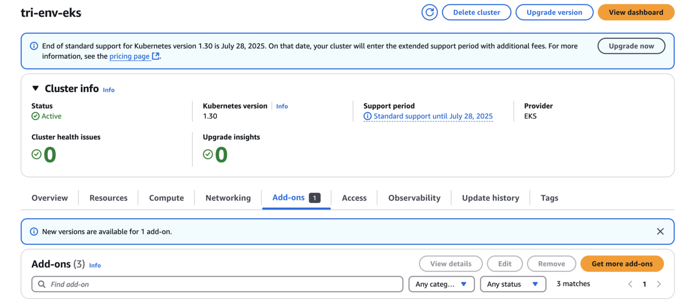
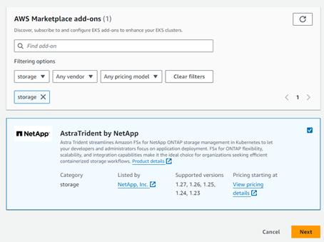
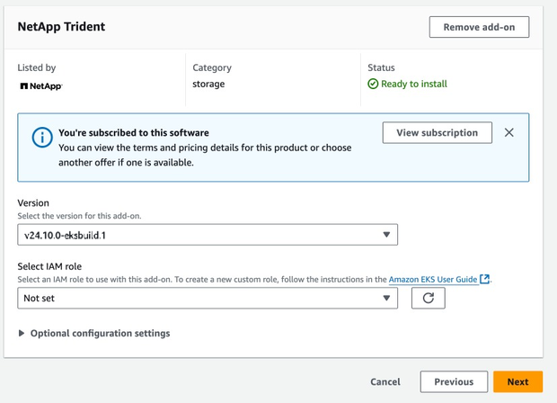
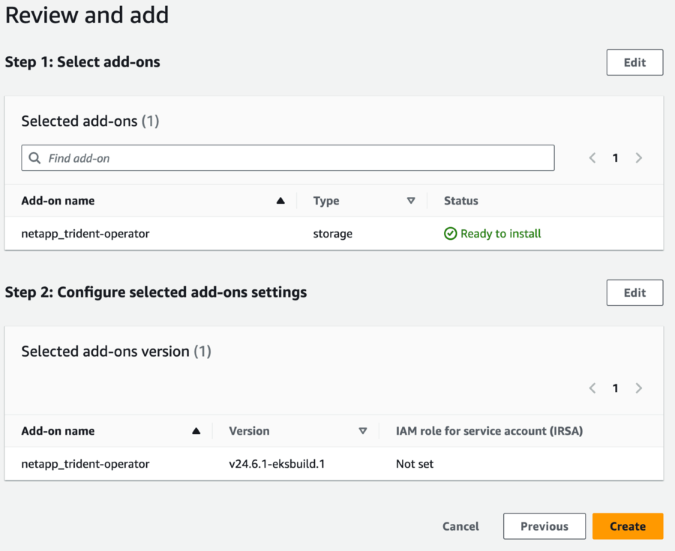
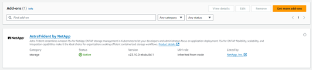

= Configure the Trident EKS add-on on an EKS cluster
:hardbreaks:
:icons: font
:imagesdir: ../media/

[.lead]
NetApp Trident streamlines Amazon FSx for NetApp ONTAP storage management in Kubernetes to enable your developers and administrators focus on application deployment. The NetApp Trident EKS add-on includes the latest security patches, bug fixes, and is validated by AWS to work with Amazon EKS. The EKS add-on enables you to consistently ensure that your Amazon EKS clusters are secure and stable and reduce the amount of work that you need to do in order to install, configure, and update add-ons.

== Prerequisites
Ensure that you have the following before configuring the Trident add-on for AWS EKS:

* An Amazon EKS cluster account with permissions to work with add-ons. Refer to link:https://docs.aws.amazon.com/eks/latest/userguide/eks-add-ons.html[Amazon EKS add-ons^]. 
* AWS permissions to the AWS marketplace:
    `"aws-marketplace:ViewSubscriptions",
    "aws-marketplace:Subscribe",
    "aws-marketplace:Unsubscribe`
* AMI type: Amazon Linux 2 (AL2_x86_64) or	Amazon Linux 2  Arm(AL2_ARM_64)
* Node type: AMD or ARM
* An existing Amazon FSx for NetApp ONTAP file system

== Steps
. Make sure to create IAM role and AWS secret to enable EKS pods to access AWS resources. For instructions, see link:../trident-use/trident-fsx-iam-role.html[Create an IAM role and AWS Secret^].
. On your EKS Kubernetes cluster, navigate to the *Add-ons* tab.
+

+
. Go to *AWS Marketplace add-ons* and choose the _storage_ category.
+

+
. Locate *NetApp Trident* and select the checkbox for the Trident add-on, and click *Next*.
. Choose the desired version of the add-on.
+

+
. Configure the required add-on settings.
+

+
. If you are using IRSA (IAM roles for service account), refer to the additional configuration steps link:https://docs.netapp.com/us-en/trident/trident-use/trident-fsx-install-trident.html#enable-the-trident-add-on-for-aws[here].
+
//// 
* Beginning with 25.02 release, Trident supports automatic backend configuration. Trident creates the backend and storage classes seamlessly after Trident installation. To enable automatic backend configuration, add the `ontapConfigurator` parameter and specify `authType`, `fsxnID`, and `protocols` in the Add-on configuration schema along with `cloudIdentity` during the installation.
+
[source,json]
----
{
  "ontapConfigurator": {
    "enabled": true,
    "svms": [
      {
        "authType": "awsarn",
        "fsxnID": "fs-0dfeaa884a68b1cab",
        "protocols": [
          "nfs",
          "iscsi"
        ]
      }
    ]
  }
}
----
+
NOTE: To disable automatic backend configuration, upgrade the Trident release version and set the *ontapConfigurator* to *false*. 
////
. Select *Create*.
. Verify that the status of the add-on is _Active_.
+

+
. Run the following command to verify that Trident is properly installed on the cluster: 
+
----
kubectl get pods -n trident
----
. Continue the setup and configure the storage backend. For information, see link:../trident-use/trident-fsx-storage-backend.html[Configure the Storage Backend^].

== Install/uninstall the Trident EKS add-on using CLI

.Install the  NetApp Trident EKS add-on using CLI:
The following example command installs the Trident EKS add-on:
`eksctl create addon --cluster clusterName --name netapp_trident-operator --version v25.6.0-eksbuild.1` (with a dedicated version)

The following example command installs the Trident EKS add-on version 25.6.1:
`eksctl create addon --cluster clusterName --name netapp_trident-operator --version v25.6.1-eksbuild.1` (with a dedicated version)

The following example command installs the Trident EKS add-on version 25.6.2:
`eksctl create addon --cluster clusterName --name netapp_trident-operator --version v25.6.2-eksbuild.1` (with a dedicated version)

.Uninstall the NetApp Trident EKS add-on using CLI:
The following command uninstalls the Trident EKS add-on:
----
eksctl delete addon --cluster K8s-arm --name netapp_trident-operator
----
