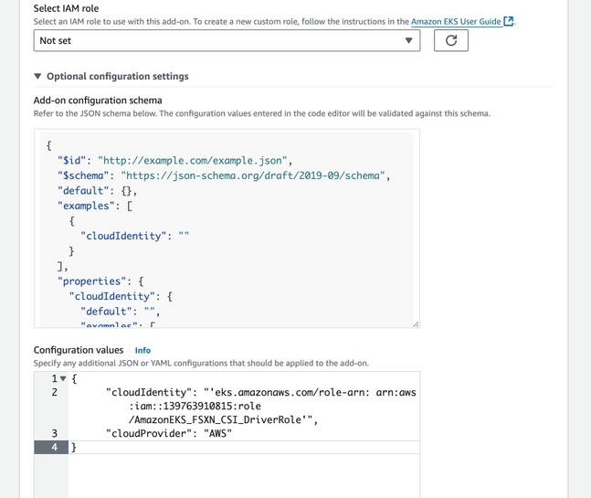

= Configure the Astra Trident EKS add-on on an EKS cluster
:hardbreaks:
:icons: font
:imagesdir: ../media/

[.lead]
Trident streamlines Amazon FSx for NetApp ONTAP storage management in Kubernetes to enable your developers and administrators focus on application deployment. The Trident EKS add-on includes the latest security patches, bug fixes, and is validated by AWS to work with Amazon EKS. The EKS add-on enables you to consistently ensure that your Amazon EKS clusters are secure and stable and reduce the amount of work that you need to do in order to install, configure, and update add-ons.

== Prerequisites
Ensure that you have the following before configuring the Trident add-on for AWS EKS:

* An Amazon EKS cluster account with add-on subscription
* AWS permissions to the AWS marketplace:
    `"aws-marketplace:ViewSubscriptions",
    "aws-marketplace:Subscribe",
    "aws-marketplace:Unsubscribe`
* AMI type: Amazon Linux 2 (AL2_x86_64) or	Amazon Linux 2  Arm(AL2_ARM_64)
* Node type: AMD or ARM
* An existing Amazon FSx for NetApp ONTAP file system

== Steps
. On your your EKS Kubernetes cluster, navigate to the *Add-ons* tab.
+
image::../media/aws-eks-01.png[]
+
. Go to *AWS Marketplace add-ons* and choose the _storage_ category.
+
image::../media/aws-eks-02.png[]
+
. Locate *NetApp Trident* and select the checkbox for the Trident add-on.
. Choose the desired version of the add-on.
+
image::../media/aws-eks-03.png[]
+
. Select the IAM role option to inherit from the node.
+
image::../media/aws-eks-04.png[]
+
. Expand the *Optional configuration settings*, follow the *Add-on configuration schema* and set the configurationValues parameter on the *Configuration values* section to the role-arn you created on the previous step (value should be in the following format: `eks.amazonaws.com/role-arn: arn:aws:iam::464262061435:role/AmazonEKS_FSXN_CSI_DriverRole`). If you select Override for the Conflict resolution method, one or more of the settings for the existing add-on can be overwritten with the Amazon EKS add-on settings. If you don't enable this option and there's a conflict with your existing settings, the operation fails. You can use the resulting error message to troubleshoot the conflict. Before selecting this option, make sure that the Amazon EKS add-on doesn't manage settings that you need to self-manage.
+

+
. Select *Create*.
. Verify that the status of the add-on is _Active_.
+
image::../media/aws-eks-05.png[]

== Install/uninstall the Trident EKS add-on using CLI

.Install the Trident EKS add-on using CLI:
The following example command installs the Trident EKS add-on:
`eksctl create addon --cluster K8s-arm --name netapp_trident-operator --version v24.10.0-eksbuild`
`eksctl create addon --cluster clusterName --name netapp_trident-operator --version v24.10.0-eksbuild.1` (with a dedicated version)

.Uninstall the Trident EKS add-on using CLI:
The following command uninstalls the Trident EKS add-on:
`eksctl delete addon --cluster K8s-arm --name netapp_trident-operator`
